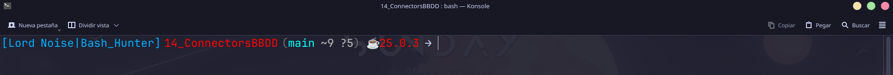

# Low Noise Prompt (LNP)

> **Un framework profesional para la creación de prompts dinámicos en Bash.**
>
> Modular, rápido, elegante y diseñado con una arquitectura limpia.

<p align="center">

<!-- Captura principal -->



</p>

---

# ¿Qué es Low Noise Prompt?

**Low Noise Prompt (LNP)** nace de una idea muy sencilla:

> Un prompt no debería ser una enorme variable `PS1`.

La mayoría de prompts para Bash acaban convirtiéndose en cientos de líneas difíciles de mantener, donde la lógica, el renderizado y la configuración están completamente mezclados.

LNP propone una filosofía diferente.

En lugar de construir un prompt, construye un **motor de contexto**.

Cada módulo obtiene información del sistema, la almacena en un contexto común y un renderizador independiente transforma ese contexto en el prompt final.

El resultado es un sistema:

* Modular
* Escalable
* Fácil de mantener
* Extremadamente rápido
* Escrito íntegramente en Bash

---

# Filosofía

Low Noise Prompt sigue una regla muy sencilla:

> **Mostrar únicamente la información necesaria para tomar la siguiente decisión.**

Sin ruido.

Sin información duplicada.

Sin adornos innecesarios.

Cada elemento del prompt existe porque aporta valor.

---

# Características

* 100% Bash
* Sin dependencias externas
* Arquitectura modular
* Carga automática de módulos
* Motor de contexto
* Sistema de temas
* Detección automática de proyectos
* Integración completa con Git
* Detección de lenguajes
* Detección de entornos de desarrollo
* Sistema de caché
* Configuración sencilla
* Alto rendimiento

---

# Arquitectura

LNP separa completamente la lógica de la representación visual.

```text
Módulos
    │
    ▼
Motor de Contexto
    │
    ▼
Renderizador
    │
    ▼
Prompt (PS1)
```

Cada componente tiene una única responsabilidad.

Los módulos nunca construyen el prompt.

El renderizador nunca detecta información.

Esta separación permite que el proyecto pueda crecer sin convertirse en un script difícil de mantener.

---

# Estructura del proyecto

```text
Low_Noise_BashPrompt/

├── prompt.sh
├── config.sh
├── install.sh
├── uninstall.sh
│
├── core/
├── modules/
├── themes/
└── tests/
```

Cada directorio tiene una función concreta.

| Directorio  | Descripción                       |
| ----------- | --------------------------------- |
| **core**    | Núcleo del framework              |
| **modules** | Módulos que recopilan información |
| **themes**  | Apariencia visual                 |
| **tests**   | Pruebas del proyecto              |

---

# Motor de Contexto

El núcleo del proyecto es un contexto compartido.

Todos los módulos escriben información en él.

Ejemplo:

```bash
LNP_CONTEXT[project]
LNP_CONTEXT[git_branch]
LNP_CONTEXT[language]
LNP_CONTEXT[runtime]
```

Después, el renderizador utiliza únicamente ese contexto para generar el prompt.

Gracias a esta arquitectura, añadir nuevos módulos no requiere modificar el resto del proyecto.

---

# Sistema de módulos

Cada módulo tiene una única responsabilidad.

Por ejemplo:

* Proyecto
* Git
* Lenguaje
* Python
* Java
* Rust
* Node
* Docker

Los módulos son completamente independientes entre sí.

Añadir uno nuevo consiste simplemente en copiar un archivo dentro del directorio `modules/`.

No es necesario modificar el resto del código.

---

# Sistema de temas

Los temas únicamente definen la apariencia visual.

Nunca contienen lógica.

Esto permite cambiar completamente el aspecto del prompt sin modificar ninguno de los módulos.

---

# Ejemplo

```text
[Lord Noise|Bash_Hunter] VOXEN (main +2 ~1 ?3) ->
```

Cada elemento comunica una información concreta:

* Identidad
* Proyecto actual
* Rama Git
* Estado del repositorio
* Símbolo del prompt


---

# Instalación

```bash
git clone https://github.com/Adri-Coding-Dev/Low_Noise_BashPrompt.git

cd Low_Noise_BashPrompt

chmod +x install.sh

./install.sh
```

---

# Configuración

Toda la configuración se encuentra en un único archivo.

```text
config.sh
```

Ejemplo:

```bash
LNP_THEME="tokyo-night"

LNP_SYMBOL="->"

LNP_SHOW_GIT=true

LNP_SHOW_RUNTIME=true
```

El objetivo es que la personalización sea sencilla y centralizada.

---

# Principios de diseño

Durante el desarrollo del proyecto se siguen varios principios de ingeniería de software.

## Una única responsabilidad

Cada módulo hace una sola cosa.

---

## Separación de responsabilidades

La detección de información y el renderizado son procesos completamente independientes.

---

## Rendimiento

El prompt se ejecuta continuamente.

Por ello, se minimizan:

* procesos externos
* llamadas a Git
* recorridos por el sistema de archivos

El objetivo es que el refresco sea prácticamente instantáneo.

---

## Modularidad

Todo componente debe poder eliminarse o sustituirse sin afectar al resto del proyecto.

---

# Hoja de ruta

* [x] Arquitectura principal
* [x] Cargador automático de módulos
* [x] Motor de contexto
* [x] Sistema de temas
* [x] Renderizador
* [x] Integración con Git
* [x] Detección de lenguajes
* [x] Detección de entornos
* [ ] API para plugins
* [ ] Nuevos temas
* [ ] Benchmarks
* [ ] Integración continua
* [ ] Pruebas automáticas
* [ ] Documentación avanzada

---

# ¿Por qué Bash?

Porque Bash está presente en prácticamente cualquier distribución Linux.

LNP demuestra que un proyecto bien diseñado no depende del lenguaje utilizado, sino de la arquitectura sobre la que está construido.

---

# Inspiración

Este proyecto toma ideas de herramientas como:

* Starship
* Oh My Posh
* Powerlevel10k

Pero con una filosofía diferente:

> Construir un framework de prompts profesional utilizando únicamente Bash.

---

# Contribuir

Las contribuciones son bienvenidas.

Puedes colaborar:

* Reportando errores.
* Proponiendo mejoras.
* Enviando Pull Requests.
* Sugiriendo nuevos módulos o temas.

---

# Licencia

Este proyecto se distribuye bajo licencia **MIT**.

---

<p align="center">

Desarrollado con dedicación para quienes disfrutan de un terminal limpio, rápido y elegante.

**Low Noise Project**

</p>

